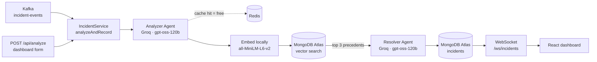

# DevOps Incident Responder

**Reads production logs, diagnoses the failure, and recommends a fix — grounded in your own
team's past incidents rather than in general knowledge about software.**

An alert fires at 2am. The engineer opens ten thousand lines of logs, searches Slack for "has
this happened before", finds a runbook, and forty minutes later understands the problem. The
fix itself takes five minutes.

**That forty minutes is the target.** Not the fix — the understanding.

---

## What it actually does

Every incident, from either entry point, goes through the same four steps:

| | Step | Output |
|---|---|---|
| 1 | **Analyze** the raw log dump | error type, affected service, severity, key evidence, confidence |
| 2 | **Embed** the diagnosis and search past incidents | the 3 most similar resolved incidents |
| 3 | **Resolve** — compare against precedent | root cause, ranked actions, **and the evidence that decided it** |
| 4 | **Store and broadcast** | persisted to MongoDB, pushed live to every open dashboard |

Two entry points share that one pipeline: a **Kafka topic** for automated alerts, and
**`POST /api/analyze`** for a human pasting a log dump into the dashboard. They share it
deliberately — two entry points that both diagnose incidents must not be able to diagnose them
differently.

---

## The two things that make this more than a chatbot wrapper

### 1. It learns from your organisation's incidents, not the internet

A general model knows what a connection pool is. It does not know that **your** connection pool
alerts were caused by a missing index in February and by a downstream timeout in April — and it
certainly does not know which of those two your current incident resembles.

So the Resolver never reasons from scratch. Each diagnosis is embedded and matched against a
corpus of **resolved** incidents, and the retrieved precedents carry the write-up a human
recorded *after actually fixing it*. That human write-up is the only thing retrieval ever shows
the agent.

One rule protects the corpus, and it is the difference between a system that learns and one
that drifts:

> **The machine's proposed `resolution` is never written into the human's `resolutionNotes`.**
> Nothing on the live path writes `resolutionNotes` at all.

Merge those two fields and the agent starts receiving its own past guesses back as evidence, and
the corpus slowly converges on whatever the model already believed. Keeping them separate is why
precedent stays worth something.

### 2. `decidingEvidence` — the Resolver names what made it choose

Retrieval returns three similar incidents. They frequently **disagree** — the corpus contains
deliberate contrast pairs, incidents with near-identical symptoms and opposite resolutions.

So the Resolver's first output field is not the root cause. It is the observation that separated
the precedents:

```json
{
  "decidingEvidence": "Pool wait-time climbs while query latency stays flat - matches INC-2103's undersized pool, not INC-2464's slow query.",
  "rootCause": "...",
  "suggestedActions": ["...", "..."],
  "similarIncidents": ["INC-2103", "INC-2464"]
}
```

**And when there is nothing to decide, it has to say so.** Three reserved values keep that
honest, rather than letting the model invent a rationale:

| Value | Meaning |
|---|---|
| `PRECEDENTS AGREE` | the retrieved incidents pointed the same way; nothing needed discriminating |
| `NO RELEVANT PRECEDENT` | none of them were close enough to reason from |
| `NOT STATED` | the model declined to name one — substituted by the server and logged at WARN |

The field is first in the output **on purpose**. Generation is autoregressive: put `rootCause`
first and the model commits to a conclusion before any comparison work can happen, then
rationalises. Ordering the fields this way gives the comparison somewhere to run.

> ⚠️ **Honest caveat.** That mechanism was measured on `llama-3.3-70b-versatile`, which Groq has
> since retired. The project now runs `openai/gpt-oss-120b`, a reasoning model that thinks before
> emitting any content — so the ordering argument may now be redundant, or may still be
> load-bearing. **It has not been re-measured.** See [docs/resolver.md](docs/resolver.md), which
> carries the same warning at the top.

---

## Architecture



Both agents degrade rather than fail. A retrieval failure resolves with no precedent; a Resolver
failure stores the diagnosis with a null resolution rather than losing work already paid for; a
dead dashboard socket can never cost a diagnosis.

---

## Tech stack — and why each piece is there

No component without a reason.

| | Why it is here |
|---|---|
| **Java 21 · Spring Boot 3.5** | The domain is backend infrastructure; the deployment target is a single JVM service. |
| **LangChain4j → Groq** (`openai/gpt-oss-120b`) | Typed agent interfaces over structured JSON output. Uses the **prompt-based** JSON path, not native `json_schema` — Groq's schema support is model-dependent. |
| **MongoDB Atlas** | Storage **and** vector search in one system. A separate vector database would mean two stores to keep consistent for a corpus this size. Atlas is not swappable for community MongoDB here: `$vectorSearch` has no equivalent there. |
| **Kafka** | Gives alerting systems a way in that is not a synchronous HTTP call, and puts the failure policy in **one** place — malformed events go straight to a dead-letter topic, analyzer failures retry once. Also lets ingestion be *paced*, which matters when each event costs real tokens. |
| **Redis** | Caches Analyzer responses. **The motivation is quota, not latency**: the free tier is 100k tokens/day and one Analyzer call measured 5,121. The key covers the model id, both prompts, the output schema and the enum vocabularies, so editing a prompt invalidates entries automatically. |
| **Local embeddings** (ONNX, all-MiniLM-L6-v2) | **Groq serves no embeddings endpoint at all**, so this was never a quota decision. Running in-process keeps the test suite offline, adds no fourth credential, and makes retrieval quality deterministic and free to re-measure. Costs ~200MB of jars in the image. |
| **React · Vite · Tailwind** | One dashboard page: live feed, detail, severity filter, submit form. Raw `WebSocket`, no STOMP or SockJS — one broadcast of one type to every client has nothing to route. |
| **Docker Compose** | The whole stack from one command, with the bundle and the API served by **one process on one origin** — so there is no CORS configuration anywhere in the backend. |

---

## Setup

**Prerequisites:** Docker, a [Groq](https://console.groq.com) API key, and a MongoDB Atlas
cluster with a vector index on the `incidents` collection.

Create `.env` in the repo root:

```
GROQ_API_KEY=gsk_...
MONGODB_URI=mongodb+srv://...
```

Then one command:

```bash
docker compose --profile app up -d --wait --build
```

Open **http://localhost:8080**.

**What to expect.** The page loads, the WebSocket connects, and the feed fills with the **ten
most recent incidents** replayed on connect. On a fresh database those are all seeded historical
incidents with `INC-` ids and no machine resolution — they show the human's write-up instead.
That is correct, not a bug: a live-only stream would leave the dashboard blank for hours, and a
blank dashboard is indistinguishable from a broken one.

Paste a log dump into the form to analyze a new incident. To see the Kafka path instead:

```bash
docker compose -f docker-compose.yml -f docker-compose.simulator.yml --profile app up -d --wait
```

That emits one simulated incident, which costs roughly 9,800 tokens.

<details>
<summary><b>Development setup</b> — frontend hot reload, backend in an IDE</summary>

Infrastructure only, then run the Spring app from your IDE:

```bash
docker compose up -d --wait
```

```bash
cd frontend && npm run dev
```

The dashboard is on http://localhost:5173 and proxies `/api` and `/ws` to port 8080, so the
browser still only ever calls its own origin.

</details>

---

## Known limitations

Stated plainly. All of these are deliberate trade-offs or recorded debt, not surprises.

**Nothing is authenticated.** Anyone who can reach the port can read every incident the system
has diagnosed. True of the REST endpoints too — the WebSocket only makes it continuous.

**The free tier caps this at about ten incidents a day.** One incident is two model calls,
roughly 9,800 tokens against 100k/day. It also binds *per minute*: a single incident's two calls
together exceed the 8,000-token minute bucket, so the Resolver is sometimes rate-limited within
one incident. It waits 15s and retries once — which usually recovers, and **has been observed to
fail**, leaving a stored diagnosis with no resolution.

**Ingestion is at-least-once and nothing deduplicates.** A crash between the model call and the
offset commit re-runs the event: duplicate document, second bill. The `eventId` is carried and
logged so a duplicate is identifiable, but nothing acts on it yet.

**The dead-letter topic has no consumer.** Failed events are kept rather than lost, which was the
point, but noticing them means running a console consumer by hand.

**Retrieval ranking inside a cluster means nothing.** Recall into the right cluster is reliable;
the order within it is not. Three related incidents sit within 0.03 of each other, and the two
whose *conclusions* agree are the furthest apart of the three. Nothing downstream may treat "the
top match" as the answer — the Resolver is given the set and has to discriminate. Tuning will not
fix this, because what separates the causes lives in the human write-up, which the query side
does not have.

**Accuracy figures in the docs predate the current model.** The Analyzer and Resolver were
measured on `llama-3.3-70b-versatile`; Groq retired it, and the move to `openai/gpt-oss-120b` has
**not** been re-measured. [docs/baseline.md](docs/baseline.md) and
[docs/resolver.md](docs/resolver.md) are history, not baselines, and say so at the top. A full
re-run costs more than a day of quota.

**Single instance, in-memory sessions.** A restart drops every connected dashboard; they
reconnect into a fresh backlog. A second instance would need a shared fan-out.

**The stream has no cursor.** Every client replays the last ten incidents on connect and cannot
discover what it missed beyond them. At ten incidents a day that is over a day of history, so the
gap is currently theoretical.

**One known diagnostic failure, deliberately untouched.** A cache-miss spike is graded MEDIUM
where LOW was expected. It is left alone until the evaluation set has more than one LOW sample —
tuning against a single example is how you fit noise.

---

## Documentation

The reasoning behind each decision, including the ones that were measured and reversed:

| Document | Covers |
|---|---|
| [docs/baseline.md](docs/baseline.md) | Analyzer prompt tuning and the 8-sample evaluation *(pre-model-change)* |
| [docs/retrieval.md](docs/retrieval.md) | Embedding recipe, and why intra-cluster rank is worthless |
| [docs/resolver.md](docs/resolver.md) | `decidingEvidence`, measured before and after *(pre-model-change)* |
| [docs/infra.md](docs/infra.md) | Kafka listeners, and the advertised-address trap |
| [docs/ingestion.md](docs/ingestion.md) | Consumer failure policy, DLT, poll sizing |
| [docs/caching.md](docs/caching.md) | Cache key design and the rate-limit retry |
| [docs/websocket.md](docs/websocket.md) | Frame contract, connect sequence, ordering guarantees |
| [docs/frontend.md](docs/frontend.md) | Dashboard contract rules and the CORS decision |
| [docs/deployment.md](docs/deployment.md) | Multi-stage build, one origin, the empty allowlist |

A note on how these are written: they record what was **measured**, including findings that were
later overturned. Several conclusions in this project were reached on two agreeing observations
and killed by a third, and those reversals are left in rather than tidied away.
